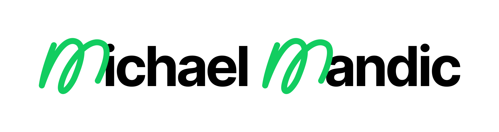

## About Me

I’m **Michael Mandic**, a software engineering student @ *University of Belgrade, School of Electrical Engineering.*
I'm passionate about computer science and full-stack development and I’m eager to contribute to real-world projects and gain industry experience.

## Skills

- `Programming Languages:` Python, C++, JavaScript, HTML/CSS
- `Tools:` Git, VS Code, PyCharm, Figma, Word, Excel, PowerPoint
- `Languages:` English (Advanced), Serbian (Native), German (Basic)

## Get In Touch

You can contact me at [mihajlomandic27@gmail.com](mailto:mihajlomandic27@gmail.com) or via [LinkedIn](https://www.linkedin.com/in/michael-mandic).

## Links

Check out my website <a target="_blank" href="https://mandic.dev">mandic.dev</a>!

