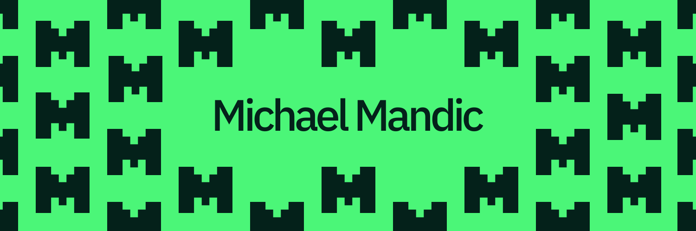

</img>

# Hi, I'm Michael!

I’m **Michael Mandic**, a software engineering student @ *University of Belgrade, School of Electrical Engineering.*
I'm passionate about computer science and full-stack development and I’m eager to contribute to real-world projects and gain industry experience.

## Skills

### Programming Languages & Frameworks

Python, C++, JavaScript, HTML/CSS, React, Next.js, TailwindCSS

### Tools

Git, Linux, VS Code, PyCharm, Figma, MS Office/365

### Languages

English (Fluent), Serbian (Native), German (Conversational)

## Get In Touch

You can email me at [mihajlomandic27@gmail.com](mailto:mihajlomandic27@gmail.com) or [hi@michaelmandic.com](mailto:hi@michaelmandic.com), or send a message on [LinkedIn](https://www.linkedin.com/in/michael-mandic).
***

<a target="_blank" href="https://michaelmandic.com">michaelmandic.com</a>

